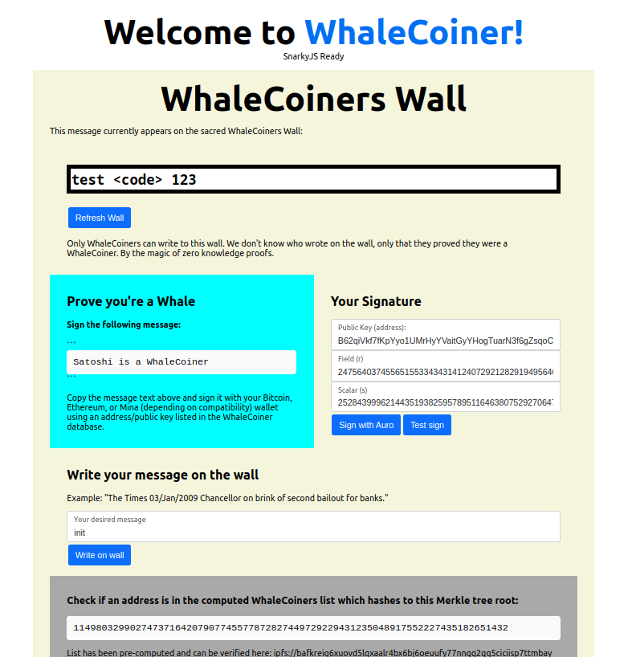
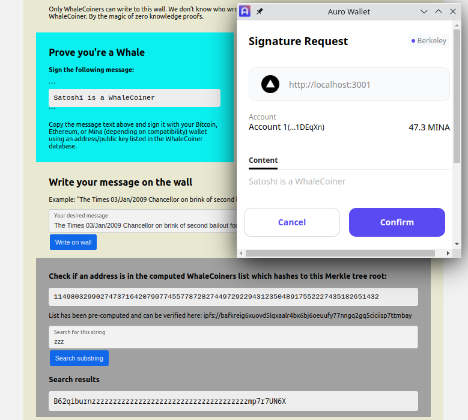

# WhaleCoiner

Zero-knowledge proof smart contract using SnarkyJS/Mina to do cool things if you can prove you're a "WhaleCoiner" (or a wholecoiner). The "prover" stays anonymous because their identity is never sent on chain in a transaction, only a ZKP that they are a Whale.

Cool things for now: Write a message on the global WhaleCoiners Wall!
Cooler things next: Mint NFTs, access token-gated clubs, vote...

Live contract deployed on Berkeley:
https://berkeley.minaexplorer.com/wallet/B62qpJ4WFdXbah1TMnctXq2Hmsv4mEgr16BZgTCkNLY6uLw4VcsjDPY


## Features

- Global wall state that anyone can write to by proving they're a member of an elite group
- Signer / wallet owner is never revealed so Whales can stay anonymous
- Messaage signing for multiple chains by implementing their hashing algorithm. E.g. Bitcoin, Ethereum, Mina, depending on SnarkyJS.
- Auro web wallet integration
- Merkle tree generated and data stored offchain on IPFS with a hash
- Whale address lookup
- Command line interface



## How to use the web app

1. Load web page and wait for `SnarkyJS Ready` to appear.
2. Copy the message text: `Satoshi is a WhaleCoiner`
3. Use your wallet for an address in the WhaleCoiners list to sign the message
4. Copy the two fields, "r" and "s", and paste them into the form. Paste your address into the form.
5. Optionally, click the "Sign with Auro" button to use your Auro wallet to sign and fill automatically. Confirm in Auro.
6. Write your message in the box. 
7. Click "Write on wall" and confirm transaction in Auro.
8. Wait for the transaction to confirm and then click the "Refresh Wall" button to see the new global wall message.



#### Build and deploy the smart contract
```
cd contracts
npm install # one time
npm run build
npm run test
node build/src/interact.js berwhale # optional
zk deploy berkeley # run zk config first
```

The WhaleCoiners list in JSON format is at: ipfs://bafkreig6xuovd5lqxaalr4bx6bj6oeuufy77nngq2gq5ciciisp7ttmbay


#### Front End
```
cd ui
npm install # once
npm run dev
```

Then optionally export to static files in `/out` and host with a web server.

```
npm run build
npm run export
```

The web app will first show "Setting up SnarkyJS..." and then "SnarkyJS is Ready". The contract is initialized with the wall message "init".

You should see ServiceWorker registration messages in the console like:
```
COOP/COEP Service Worker registered 
Reloading page to make use of COOP/COEP Service Worker.
```

To get around "failed to register" errors from `coi-serviceworker` which will cause any `SharedArrayBuffer` calls to fail, 
try to reopen Chrome to allow ServiceWorker on `localhost` (set `PORT`) with a real SSL certificate:
```
chrome --ignore-certificate-errors --unsafely-treat-insecure-origin-as-secure=https://localhost:$PORT
```
